# Testing Advanced Raid Tracker

Download IntelliJ from this link: https://www.jetbrains.com/idea/download/?section=windows

Make sure to Install the Community version and not Ultimate:

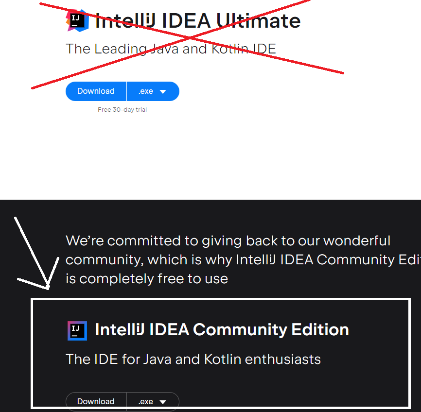

Once you install intelliJ you should see this window, press get from VCS:

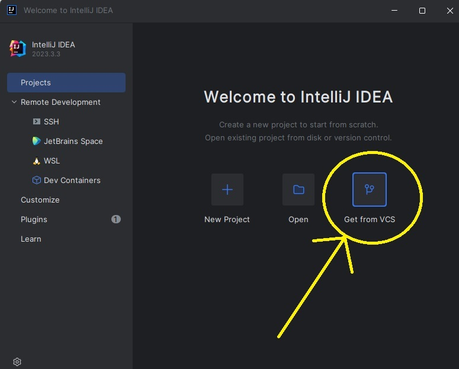

Add this link to the 'URL' box and hit clone: https://github.com/Marco648135/cTimers

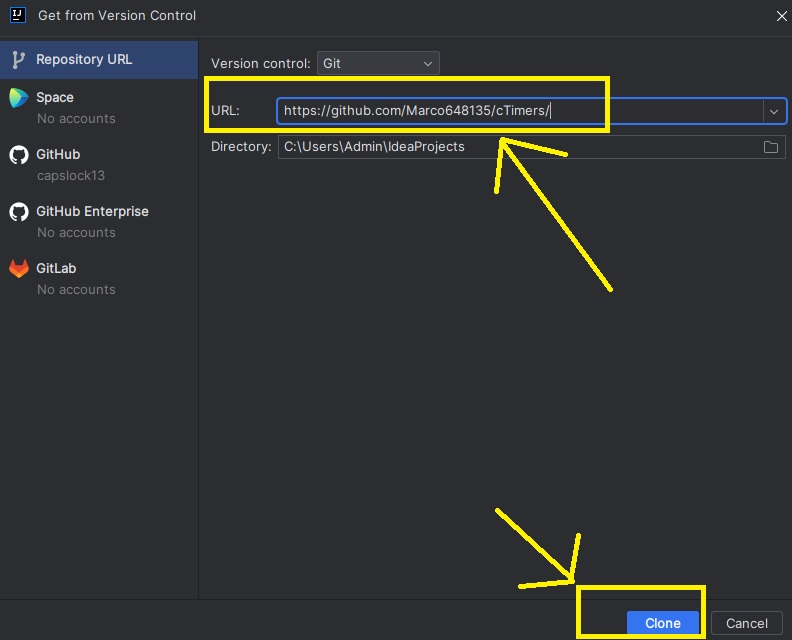

If it asks you to trust the project select trust:

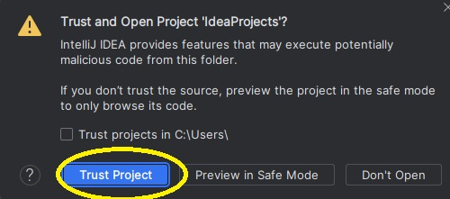

Select which branch you're using, expand the 'remote' menu option:

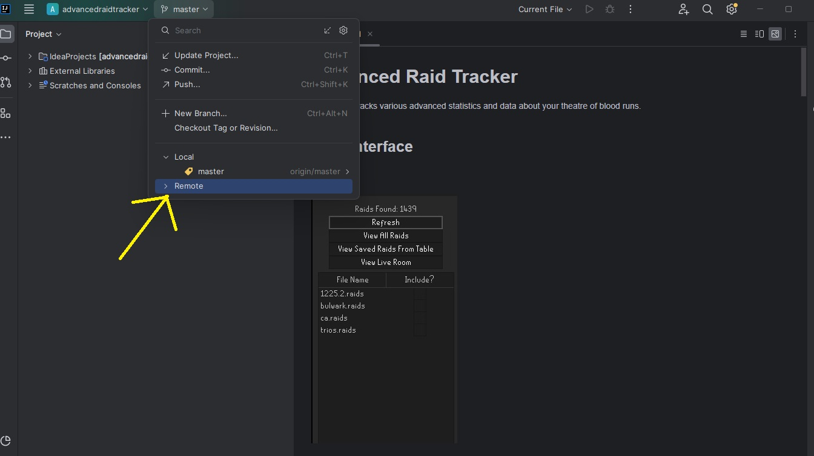

Select advanced-features -> checkout

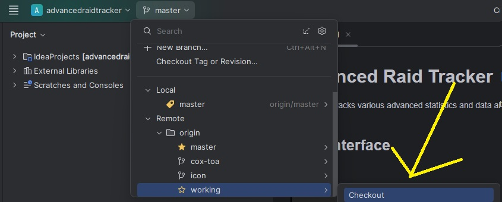

Expand the directory tree all the way to 'src/test/java/com/advancedraidtracker/AdvancedRaidTrackerTest.java' and right click and hit run

IF THERE IS NO RUN OPTION YOU HAVE TO WAIT FOR THE PROJECT TO FINISH INDEXING. THIS PROGRESS CAN BE SEEN IN THE PROGRESS BAR AT THE BOTTOM OF THE PROGRAM. IT CAN TAKE A FEW MINUTES.

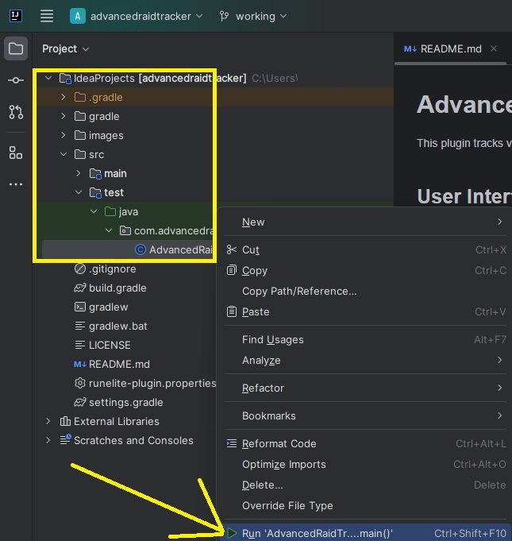

It will fail with this message:

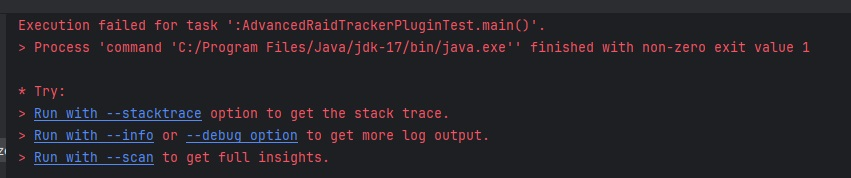

Expand the menu:

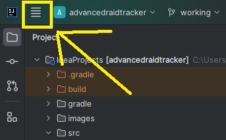

go to run->edit configurations

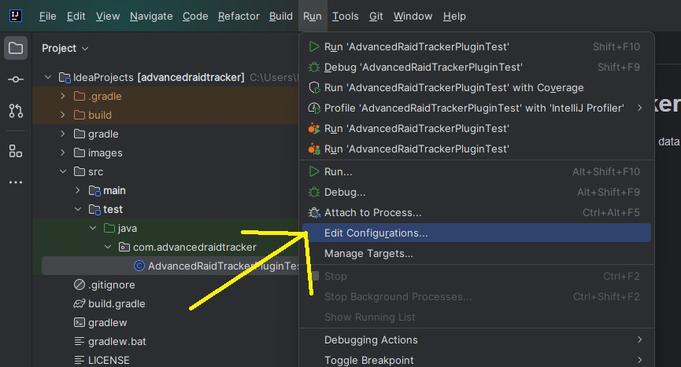

expand 'modify options'

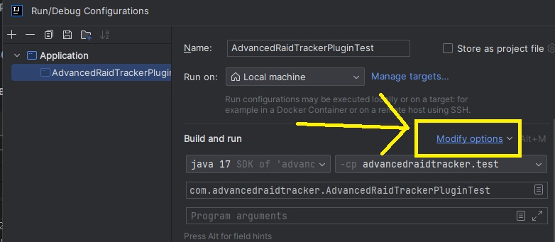

select 'add vm options'

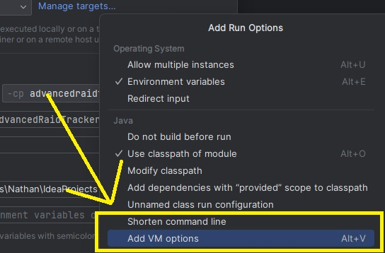

add '-ea' to the vm options box and '--developer-mode' to the program arguments then hit apply

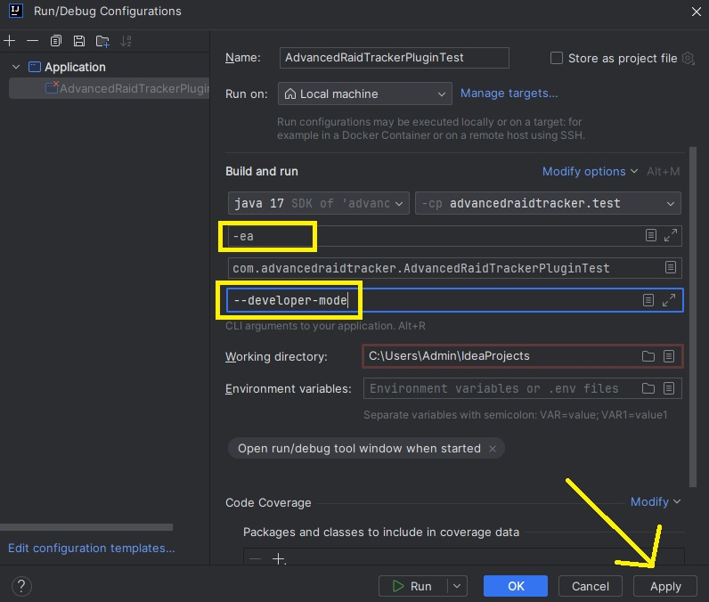

Now hit the run button and the plugin should launch in runelite

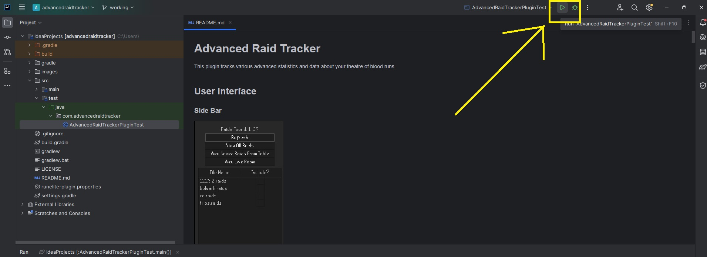

I push changes to the working branch pretty frequently, ~once per day. You can update to the latest changes at any point by going to git->update project in the menu

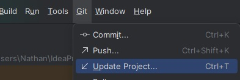
